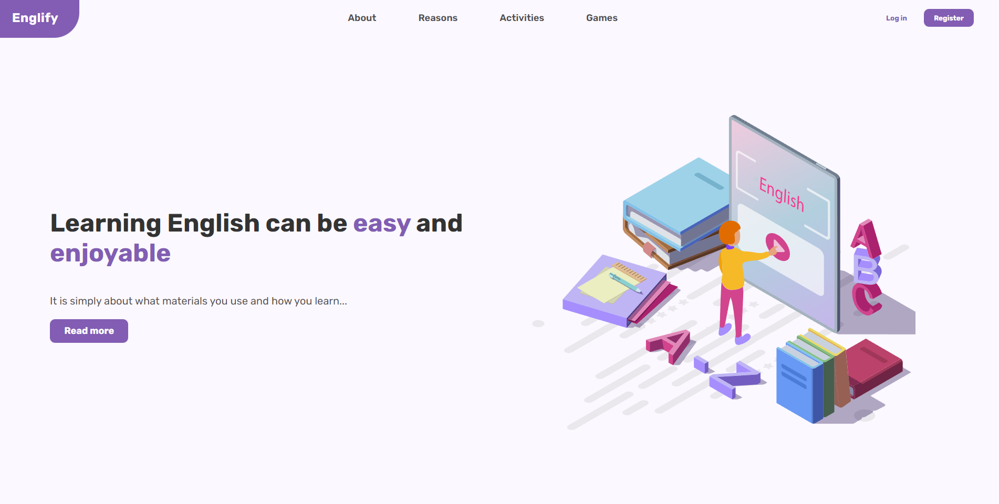

# English educational app made with MERN stack 😎

Tools I have used:
* front-end:
  * React.js
  * styled-components (styling)
  * Formik and Yup (form validations)
  * tanstack react-query v4 (managing server state)

* back-end: (not included in this repo)
  * Node.js
  * Express.js
  * mongoose (modeling data)

* database:
  * MongoDB

